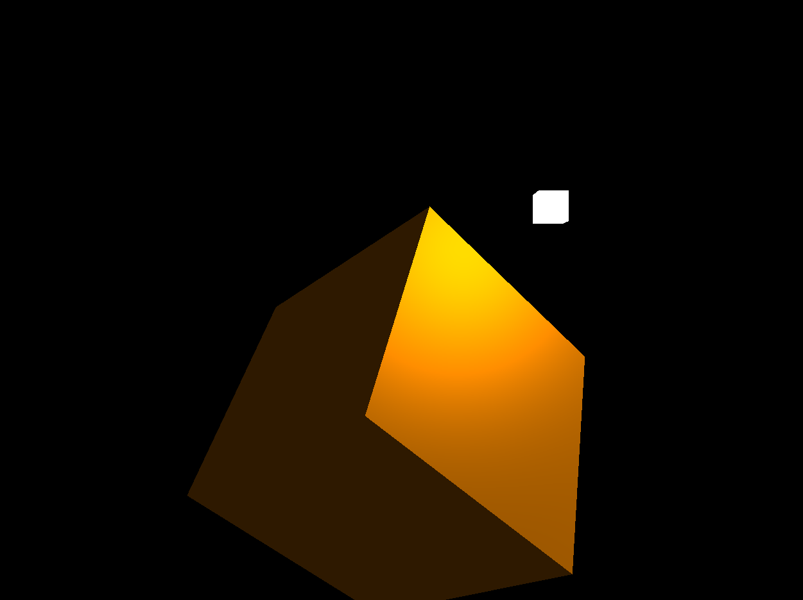

<a id="readme-top"></a>


<!-- PROJECT LOGO -->
<br />
<div align="center">
  <a href="https://github.com/tiffanychen1118/Phong-Lighting/blob/main/assets/phong-lighting-model.png">
    
  </a>

<h1 align="center">Phong Lighting</h1>

  <p align="center">
    Phong Lighting Model in OpenGL
    <br />
    <a href="https://github.com/tiffanychen1118/Phong-Lighting">Explore the docs</a>
    ·
    <a href="https://youtu.be/bz9ZHsPyZdo">View Demo</a>
    <br />
  </p>

</div>


<!-- TABLE OF CONTENTS -->
<details>
  <summary>Table of Contents</summary>
  <ol>
    <li>
      <a href="#about-the-project">About The Project</a>
      <ul>
        <li><a href="#environment">Environment</a></li>
      </ul>
    </li>
    <li>
      <a href="#getting-started">Getting Started</a>
      <ul>
        <li><a href="#installation">Installation</a></li>
      </ul>
    </li>
    <li><a href="#demo">Demo</a></li>
    <li><a href="#contact">Contact</a></li>
    <li><a href="#acknowledgments">Acknowledgments</a></li>
  </ol>
</details>


<!-- ABOUT THE PROJECT -->
## About The Project

In this project, the Phong Lighting model is implemented in OpenGL.

The steps includes:
* Create a GLFW window
* Create VBO, IBO, and VAO for cube info
* Create vertex shader and fragment shader to render the cube
* Create MVP (Model, View, Projection) matrix
* Add Phong lighting model to the fragment shader


### Environment

* Windows 11
* Visual Studio 2022
* GLEW 2.1.0
* GLFW 3.4
* GLM 1.0.1
* OpenGL
* C++
* GLSL

<p align="right">(<a href="#readme-top">back to top</a>)</p>


<!-- GETTING STARTED -->
## Getting Started

This is the steps of how to get a local copy and execute the program in Visual Studio 2022. 

### Installation

The project doesn't rely on other external dependencies or libraries. All neccessary dependencies are included and set up with relative path.

1. Clone the repo
   ```sh
   git clone https://github.com/tiffanychen1118/Phong-Lighting.git
   ```
2. Open `MyRenderer.sln` with Visual Studio 2022

3. Configure the platfrom to `Debug x86`

4. Press `F5` or click `Local Windows Debugger`. The rotating cube shall show up. 

<p align="right">(<a href="#readme-top">back to top</a>)</p>


<!-- DEMO -->
## Demo

<a href="https://youtu.be/bz9ZHsPyZdo">Phong Lighting Model Demo - YouTube</a>

https://github.com/tiffanychen1118/Phong-Lighting/assets/17548288/b69bce29-787a-4b55-abe6-3762c865c439


<!-- CONTACT -->
## Contact

[![LinkedIn][linkedin-shield]][linkedin-url]

X (Twitter) - [@graphicsDevLog](https://twitter.com/graphicsDevLog)

Project Link: [https://github.com/tiffanychen1118/Phong-Lighting](https://github.com/tiffanychen1118/Phong-Lighting)

<p align="right">(<a href="#readme-top">back to top</a>)</p>


<!-- ACKNOWLEDGMENTS -->
## Acknowledgments

These are the resources for implementing this project. [OpenGL - The Cherno - YouTube](https://youtube.com/playlist?list=PLlrATfBNZ98foTJPJ_Ev03o2oq3-GGOS2&si=nHk_QFPstL1femtw) is an awesome OpenGL series to start OpenGL from scratch. [LearnOpenGL - Basic Lighting](https://learnopengl.com/Lighting/Basic-Lighting) is an awesome tutorial best used as a reference book.

* [OpenGL - The Cherno - YouTube](https://youtube.com/playlist?list=PLlrATfBNZ98foTJPJ_Ev03o2oq3-GGOS2&si=nHk_QFPstL1femtw)
* [LearnOpenGL - Basic Lighting](https://learnopengl.com/Lighting/Basic-Lighting)
* [Best README Template](https://github.com/othneildrew/Best-README-Template)

<p align="right">(<a href="#readme-top">back to top</a>)</p>


<!-- MARKDOWN LINKS & IMAGES -->
<!-- https://www.markdownguide.org/basic-syntax/#reference-style-links -->
[linkedin-shield]: https://img.shields.io/badge/-LinkedIn-black.svg?style=for-the-badge&logo=linkedin&colorB=555
[linkedin-url]: https://www.linkedin.com/in/tiffany-hsuan-chen/
[product-screenshot]: assets/phong-lighting-model.png

